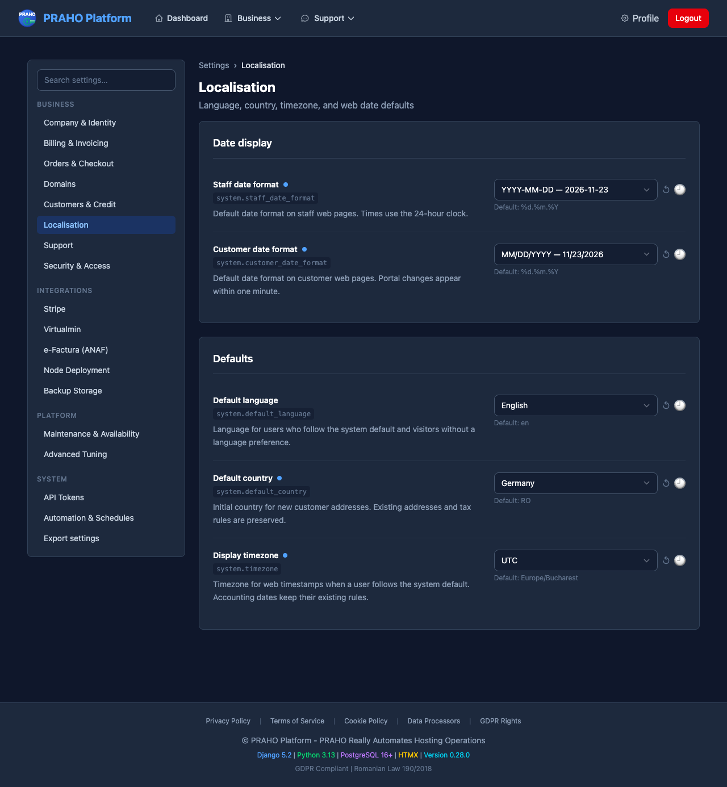

# Localisation settings and consumers

The Business → Localisation settings group controls the staff platform and
customer portal web interfaces (issue #380). The catalog remains the source of
truth and all five keys have production readers under ADR-0042.

| Key | Default | Consumer |
| --- | --- | --- |
| `system.default_language` | `en` | Web language selection and inherited profile language |
| `system.default_country` | `RO` | New customer, registration, company, and address forms |
| `system.timezone` | `Europe/Bucharest` | Web timestamp conversion |
| `system.staff_date_format` | `%d.%m.%Y` | Staff web dates |
| `system.customer_date_format` | `%d.%m.%Y` | Customer portal web dates |

Languages are English and Romanian. Countries use the existing Babel territory
data and timezones use the installed IANA database. Date settings accept only
DD.MM.YYYY, YYYY-MM-DD, DD/MM/YYYY, and MM/DD/YYYY. Times use a 24-hour clock;
operational timestamps retain seconds where they were previously displayed.

## Preferences and compatibility

Existing profile values are preserved. New profiles store empty language,
timezone, and date-format values, meaning **Use system default**. A profile
override wins over the corresponding runtime default. Selecting inheritance
again clears explicit language session/cookie selections. Legacy session
language choices remain honored until the next profile save.

Anonymous visitors use a supported explicit session/cookie language, then browser
language, then the runtime default. Signed-in users following system defaults
use those defaults regardless of browser language. Locale activation is scoped
to the web request and response language headers match the rendered content.

Country settings initialize new forms; they do not rewrite existing addresses.
Posted country values and explicit initials win. Creation APIs accept the
country and fall back to the configured default when it is omitted. Partial
updates preserve existing country values. Country-dependent consumers normalize
English/Romanian names and ISO codes through one shared helper before VAT,
validation, and audit decisions. The country setting initializes new addresses;
VAT still uses the actual billing country and tax profile, and existing fiscal
snapshots are preserved.

## Display boundary

Use `` and
`` for human-facing web dates. The optional
kind is `date` (default), `datetime`, `datetime_seconds`, `time`, `time_seconds`,
or `month_year`; Django's normal `as variable` assignment is supported.

The formatter accepts date/datetime objects and ISO strings from portal APIs.
Aware timestamps are converted explicitly to the display timezone. Plain dates
and naive timestamps are not shifted; invalid/missing input renders empty so a
template can provide its existing placeholder.

No request-wide timezone activation is used. ORM calendar lookups, recurring
billing, registry operations, scheduler clocks, invoice PDFs, and e-Factura keep
their existing rules. Billing/e-Factura pages and embedded invoice/payment dates
retain their existing fixed rendering too. Registry registration/expiry dates,
billing schedules, and scheduler next-run displays also retain their prior formats. Document/API endpoints retain their
prior language policy.
HTML date inputs and machine-readable timestamp attributes retain their wire
formats. Explicit Romanian date utilities remain available for documents.

## Portal propagation

`POST /api/localisation/` requires the existing HMAC service authentication and
a fresh signed timestamp; customer identity is not required. Its allowlisted
response contains only `default_language`, `default_country`, `timezone`, and
`customer_date_format` under `localisation`, with `success: true`.

The portal caches validated defaults for 60 seconds, scoped to its platform
endpoint and portal ID. Failure retries are spaced 30 seconds apart and use
last-known-good values for up to one hour, then built-in defaults. Failures and
malformed payloads never replace the last-known-good snapshot. Dates within a
request share one resolved policy and cause no individual API calls.

Login and periodic session-validation responses carry optional raw
`localisation_preferences`. Profile saves update the current session immediately;
other sessions refresh on their existing authentication-validation cadence.
Profile reads retain effective language/timezone fields for older clients and
add raw inheritance preferences separately. The portal can read older payloads.

Small pure helpers are mirrored across the isolated services with parity tests;
platform settings access and portal API access remain separate.

## Deployment and verification

1. Deploy the platform and apply users migration `0006_localisation_inheritance`.
   It alters field metadata/defaults and preserves stored profile values.
2. Run `setup_default_settings --category localisation` without `--force`.
   Consumers have catalog fallbacks even before the rows are synced.
3. Deploy the portal. Check the Localisation group, both profile forms, date
   rendering, and country defaults. Allow up to one minute for portal changes.
4. Run settings consumer-contract, profile/API, formatting, cache, country, and
   cross-service parity tests, plus the full lint/test gates. DCO must pass on
   every PR commit and the squash commit must retain its sign-off.

Framework references: [Django language selection](https://docs.djangoproject.com/en/5.2/topics/i18n/translation/#how-django-discovers-language-preference)
and [Django timezone presentation](https://docs.djangoproject.com/en/5.2/topics/i18n/timezones/).

## Browser regression

With the normal isolated E2E services and accounts running, execute:

```sh
make test-e2e-file FILE=tests/e2e/test_localisation.py
```

The parameterized test exercises both services, checks all four date presets,
saves name and language together, switches to Romanian, and returns every
preference to inheritance. It restores the account's original preferences and
name afterward. `PLATFORM_BASE_URL` and `PORTAL_BASE_URL` can point it at alternate
local test ports.

These screenshots use synthetic accounts and changed test defaults (Germany,
UTC, ISO staff dates and US customer dates). A separate year-boundary fixture
confirmed `2025-12-31 22:30 UTC` displays on 1 January in Europe/Bucharest.



[Customer profile with inherited defaults](images/localisation-customer-profile.png)
