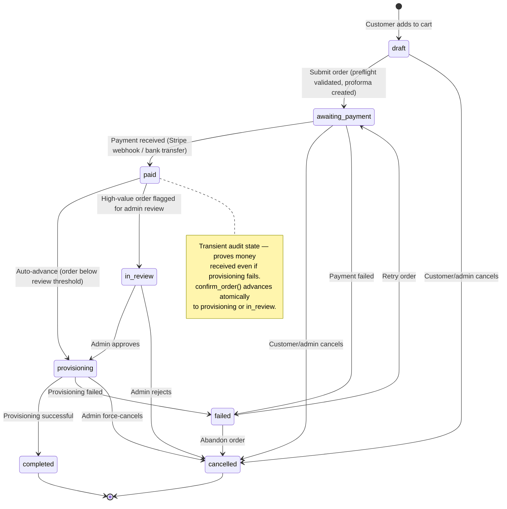
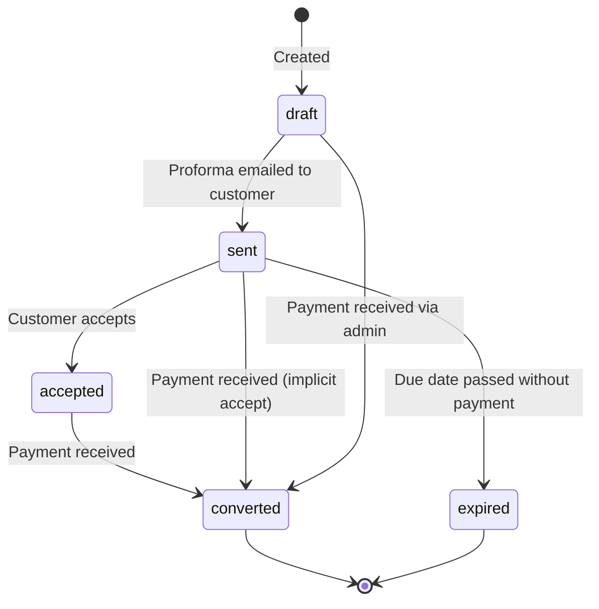
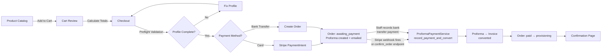

# Order Lifecycle

> **Status**: Active reference
> **Last updated**: 2026-03-22
> **Source of truth**: `services/platform/apps/orders/models.py` (FSM transitions)

---

## State Machine

> **Note on refunds:** `refunded` and `partially_refunded` exist on **Invoice** and **Payment** models, not on Order. An Order's financial reversal is tracked via its linked invoice and payment records.

## Status Definitions

| Status | Description | Editable | Customer-visible |
|--------|-------------|----------|-----------------|
| `draft` | Cart/quote stage — order can be freely modified | All fields | Yes (as "cart") |
| `awaiting_payment` | Submitted, proforma issued, waiting for payment | All fields | Yes |
| `paid` | Payment received — transient audit checkpoint before provisioning | Notes, delivery only | Yes |
| `in_review` | High-value order under admin review before provisioning | Notes only | Yes |
| `provisioning` | Services being provisioned (Virtualmin, DNS, etc.) | Notes only | Yes |
| `completed` | Fully provisioned and delivered | Read-only | Yes |
| `cancelled` | Cancelled by customer or admin (terminal) | Read-only | Yes |
| `failed` | Payment or provisioning failed | Read-only | Yes |

## Proforma Lifecycle

Every order that enters `awaiting_payment` gets a proforma invoice. Payment — regardless of method — flows through a single convergence point that converts the proforma to a tax invoice before the order advances.

| Proforma Event | When it happens |
|----------------|----------------|
| Created (`draft`) | Order transitions to `awaiting_payment` |
| Sent | Immediately after creation (email dispatched via `on_commit`) |
| Converted | Any payment path calls `ProformaPaymentService.record_payment_and_convert()` |

## Portal Order Flow (Customer-Facing)

### Key Security Controls

1. **Cart versioning** — SHA-256 hash of cart contents prevents stale mutations
2. **HMAC price sealing** — Server-authoritative pricing, tamper-proof
3. **Preflight validation** — Profile completeness checked before `draft → awaiting_payment`
4. **Terms acceptance** — EU Directive 2011/83/EU compliance (agree_terms required)
5. **Idempotency keys** — Prevents duplicate order creation from client retries
6. **AJAX vs non-AJAX** — Cart version mismatch returns JSON 400 for HTMX, redirect for full-page

### Payment Flow Details

Both payment methods converge at `ProformaPaymentService.record_payment_and_convert()` — a single idempotent method that validates payment, creates the invoice, and emits `proforma_payment_received` via `on_commit`.

**Stripe (card):**
1. Checkout → `create_payment_intent_direct()` creates a Stripe PaymentIntent and a `Payment` record linked to the proforma
2. Stripe processes the card
3. `payment_intent.succeeded` webhook fires → calls `ProformaPaymentService.record_payment_and_convert()`
4. Proforma status: `sent → converted`; Invoice created; `proforma_payment_received` signal fires
5. Signal calls `OrderPaymentConfirmationService.confirm_order()` → order advances `awaiting_payment → paid → provisioning`

**Stripe (confirm_order endpoint fallback):**
- If the webhook hasn't arrived yet, the Portal's `confirm_order` endpoint calls `record_payment_and_convert()` itself (using the `Payment` record as `existing_payment`)
- `record_payment_and_convert()` is idempotent via `select_for_update` on the proforma — whichever path arrives first converts; the second finds `status == "converted"` and returns the existing invoice

**Bank Transfer:**
1. Order created → proforma emailed to customer
2. Customer makes bank transfer
3. Staff uses the **Process Proforma Payment** view (`billing/proformas/<pk>/pay/`) to record payment
4. Same convergence: `ProformaPaymentService.record_payment_and_convert()` → invoice created → order confirmed

All three paths emit `proforma_payment_received` which triggers `OrderPaymentConfirmationService.confirm_order()`.

## FSM Implementation Notes

- **Protected field**: `FSMField(protected=True)` — direct `order.status = "xxx"` raises `AttributeError`
- **Concurrent transitions**: `Order` uses `ConcurrentTransitionMixin` (optimistic locking) — catch both `TransitionNotAllowed` and `ConcurrentTransition`
- **Test setup**: use `force_status(order, "target")` from `tests/helpers/fsm_helpers.py`
- **`paid` is transient**: `confirm_order()` advances atomically to `provisioning` or `in_review` in the same request; customers rarely see this state in the UI
- See `ADR-0034` for full FSM adoption rationale and `ADR-0038` for proforma payment convergence design
