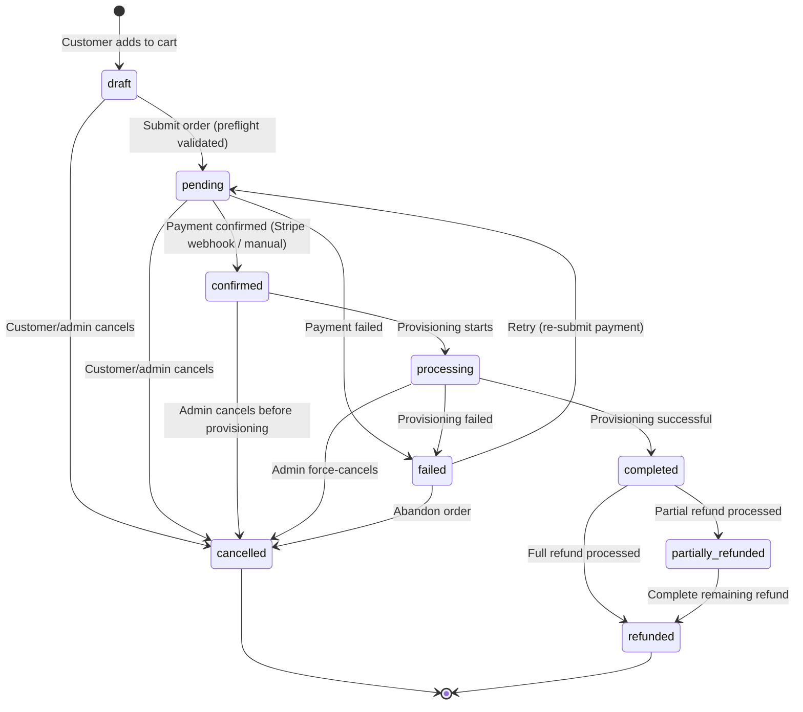
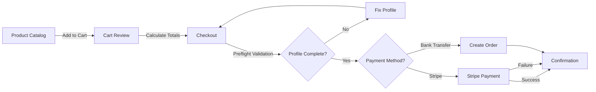

# Order Lifecycle

> **Status**: Active reference
> **Last updated**: 2026-03-09
> **Source of truth**: `services/platform/apps/orders/services.py` (`_is_valid_status_transition`)

---

## State Machine

## Status Definitions

| Status | Description | Editable | Customer-visible |
|--------|-------------|----------|-----------------|
| `draft` | Cart/quote stage — order can be freely modified | All fields | Yes (as "cart") |
| `pending` | Awaiting payment — order submitted, payment instructions sent | All fields | Yes |
| `confirmed` | Payment confirmed — ready for provisioning | Notes, delivery, shipping only | Yes |
| `processing` | Provisioning in progress (Virtualmin, DNS, etc.) | Notes only | Yes |
| `completed` | Fully provisioned and delivered | Read-only | Yes |
| `cancelled` | Cancelled by customer or admin (terminal) | Read-only | Yes |
| `failed` | Payment or provisioning failed | Read-only | Yes |
| `refunded` | Full refund processed (terminal) | Read-only | Yes |
| `partially_refunded` | Partial refund — some items refunded | Read-only | Yes |

## Portal Order Flow (Customer-Facing)

### Key Security Controls

1. **Cart versioning** — SHA-256 hash of cart contents prevents stale mutations
2. **HMAC price sealing** — Server-authoritative pricing, tamper-proof
3. **Preflight validation** — Profile completeness checked before `draft → pending`
4. **Terms acceptance** — EU Directive 2011/83/EU compliance (agree_terms required)
5. **Idempotency keys** — Prevents duplicate order creation from client retries
6. **AJAX vs non-AJAX** — Cart version mismatch returns JSON 400 for HTMX, redirect for full-page

### Payment Flow Details

- **Stripe**: Checkout JS routes to `process_payment` → creates Stripe PaymentIntent → redirects to Stripe → webhook confirms → `pending → confirmed`
- **Bank Transfer**: Creates order as `draft → pending` → customer receives bank details by email → admin confirms manually → `pending → confirmed`
- **No-JS fallback**: Server reads `payment_method` POST param and routes accordingly (BACKEND-4 progressive enhancement)
